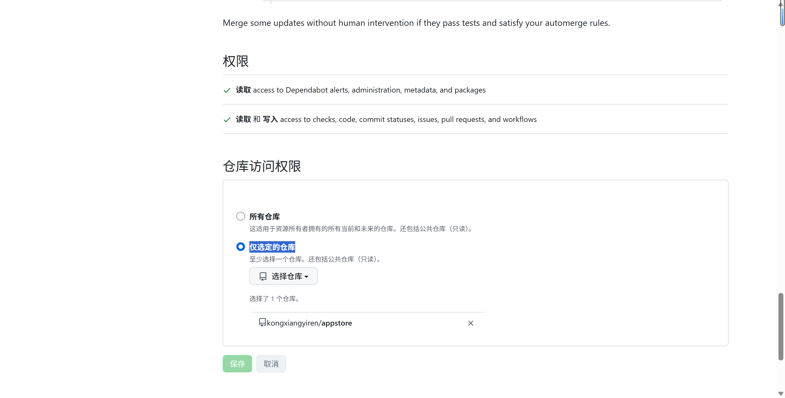
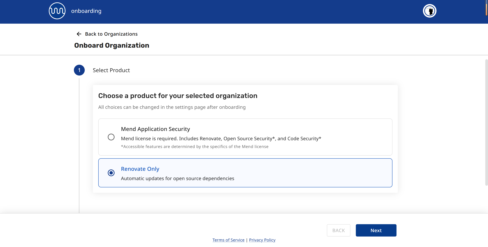
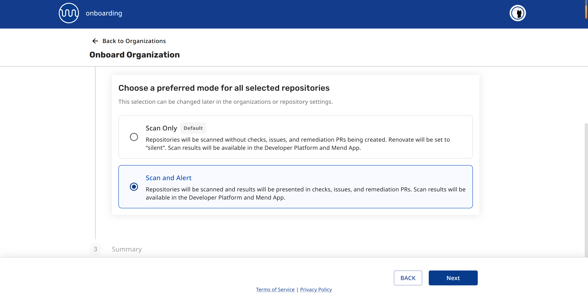

# 使用

```sh
git clone https://github.com/kongxiangyiren/alemon-appstore /opt/1panel/resource/apps/local/appstore-localApps
```

```sh
cp -rf /opt/1panel/resource/apps/local/appstore-localApps/apps/* /opt/1panel/resource/apps/local/
```

```sh
rm -r /opt/1panel/resource/apps/local/appstore-localApps
```

# 复刻说明 (github 开启 dependabot 推送)

仓库根目录已包含 `.github/dependabot.yml`,github 会自动扫描 `apps/**` 下的 `docker-compose.yml` 镜像版本并发起升级 PR。

PR 创建后会自动合并,合并后由 `.github/workflows/dependabot-app-version.yml` 自动重命名版本目录并推送。

无需安装额外 app,若仓库此前关闭过 Dependabot,需在 `Settings -> Code security and analysis -> Dependabot version updates` 中启用。

## 绑定 alemon-appstore 仓库







# 创建应用模板

```sh
cd apps
1panel app init -k <应用的key（仅支持英文）> -v <应用版本>
```
